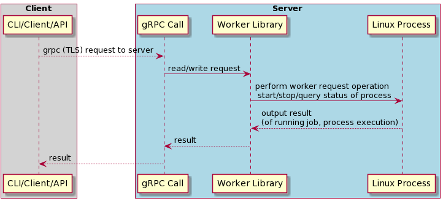

# systemd wrapper

systemd wrapper is a worker library which is capable of start/stop/query the Linux process/able to execute command and getting the output of a job. Library should be able to stream the output of a running job.
Output of the running job should be from the start of the process execution.
Multiple concurrent clients should be supported.
In addition to this, the worker library should be able to add resource control for CPU, Memory and Disk IO per job using cgroups.


## Summary

Prototype job worker service that provides an API to run arbitrary Linux processes.

## Design

### Client

The Client is a command line/API interface where the user interacts to schedule remote Linux jobs. The CLI provides communication between the user and Worker Library through the gRPC and gets the result back from the Server. With this client is capable of connecting with worker service and start, stop, get status, and stream output of jobs.

### Server side gRPC API

Server-side API is a gRPC server responsible for processing client requests and interacting with the Worker Library to start/stop/query processes. The API is also responsible for providing authentication, authorization, and secure communication between the client and server.
A Proto file for this design looks like the following which defines an overview of the method skeleton.

```golang
message StartRequest {
  string name = 1;
  repeated string args = 2;
}
message StartResponse {
  string jobID = 1;
}
message StopRequest {
  string jobID = 1;
}
message StopResponse {
}
message QueryRequest {
  string jobID = 1;
}
message QueryResponse {
  int32 pid = 1;
  int32 exitCode = 2;
  bool exited = 3;
}
message StreamRequest {
  string jobID = 1;
}
message StreamResponse {
  string output = 1;
}
service WorkerService {
  rpc Start(StartRequest) returns (StartResponse);
  rpc Stop(StopRequest) returns (StopResponse);
  rpc Query(QueryRequest) returns (QueryResponse);
  rpc Stream(StreamRequest) returns (stream StreamResponse);
}
```
### Server-side worker library

Server-side worker libraries process the client request coming from gRPC and interact with linux OS using syscall and execute commands. Worker library is responsible for start/stop/query status of Linux processes and handling errors during request executions. Worker library should give the process output (stderr/stdout). Worker library keeps the result of the process output in memory.
On the server side we will use a worker which defines the basic operations (start/stop/query) to manage Jobs (Job represents an arbitrary Linux process scheduled by the Worker). For avoiding race conditions and deadlock we will use mutex lock in each and every request from the client.

### Start Request:
For each start request we will create a job id (using uuid). After that for  starting service we will use syscall exec from the exec go library and execute command (command is a job request with the program name and arguments). It will also  create a log file corresponding to job id. We will store job requests in memory in the start request. For cgroup control (CPU, Memory, IO)we will create a respective directory  /sys/fs/cgroup/cpu/ as described in the Resource Control section.
Start request example:
```bash
$ ./bin/worker-client start ls /
Job b58476f2-9479-445b-898d-29eeaf905a47 is started
Worker client is client side executable. Start command taking all parameters which we want to give as a command. Above command will return the job id if it's successful.
```

### Stop Request:
Stop Request will be executed by first passing the job ID to the command line. With this job ID worker will retrieve the job and pid. We will give a SIGTERM signal to the respective PID for stopping the job. if the job doesn't exist an error will be returned.
For eg:
```bash
$ ./bin/worker-client stop b58476f2-9479-445b-898d-29eeaf905a47
rpc error: code = Internal desc = the process is already finished
Here the process with the above job id already finished so it's returning an error.
```

### Query Request:
Query Request will be executed by first passing the job ID to the command line. With this job ID worker will retrieve the job and pid. Workers update the status of the process in the background and it gives the result from that status.
if the job doesn't exist an error will be returned.
For eg:
```bash
$ ./bin/worker-client query b58476f2-9479-445b-898d-29eeaf905a47
Pid: 63136 Exit code: 0 Exited: true
````

### Streaming Request:
Streaming Request will be executed by first passing the job ID to the command line. With this job ID worker will retrieve the job and pid. Workers read the log file associated with the job ID. This log file already got created during the start of the command execution and this log file is saved in the file system. (we can also use log rotation)
if the job doesn't exist an error will be returned.
For eg:
````bash
$ ./bin/worker-client stream b58476f2-9479-445b-898d-29eeaf905a47
Output: list of all file/dir name in /
````


## Resource control for CPU, Memory and Disk IO per job using cgroups:
For resource control (CPU, Memory, and Disk IO..) we will use cgroups. Cgroups are a Linux kernel feature which allow processes to be organized into hierarchical groups whose usage of various types of resources can then be limited and monitored. The kernel’s cgroup interface is provided through a pseudo-file system called cgroupfs. Grouping is implemented in the core cgroup kernel code, while resource tracking and limits are implemented in a set of per-resource-type subsystems (memory, CPU, and so on).

### Setting up Cgroup limits:
Cgroup configuration is organized by file system hierarchy, for convention, the cgroup directory is mounted under /sys/fs/cgroup, the separate resource configuration directories are placed under some paths like /sys/fs/cgroup/cpu/user/user1, this is the configuration for user1’s processes.

### CPU controller:
we need to create an isolated group for this CPU limit, the configuration is usually under /sys/fs/cgroup, let’s create a new folder for this, we call this /sys/fs/cgroup/cpu/mycontainer.
````bash
$ sudo mkdir -p /sys/fs/cgroup/cpu/mycontainer
````
There are two parameter to set cpu limit:
cpu.cfs_period_us the total available run-time within a period (in microseconds)
cpu.cfs_quota_us the length of a period (in microseconds)
The actual scheduled run-time of the process will be cpu.cfs_quota_us microseconds of cpu.cfs_period_us microsends, so to use only 0.5 cores, we can specify 5000 out of 10000.

```bash
sudo su
echo 10000 > /sys/fs/cgroup/cpu/mycontainer/cpu.cfs_period_us
echo 5000  > /sys/fs/cgroup/cpu/mycontainer/cpu.cfs_quota_us
```

### Memory Controller:
Similar to the CPU controller, let’s have a look at the memory cgroup configurations.    
````
memory.usage_in_bytes # show current usage for memory
memory.memsw.usage_in_bytes # show current usage for memory+Swap
memory.limit_in_bytes # set/show limit of memory usage
memory.memsw.limit_in_bytes # set/show limit of memory+Swap usage
````
To set up the memory hard limit for the process, first we create a cgroup folder for this and write to the memory.limit_in_bytes. After that, we added the process ID to the cgroup.procs.
Eg:
````bash
sudo mkdir -p /sys/fs/cgroup/memory/mycontainer
sudo su
echo 10000000 > /sys/fs/cgroup/memory/mycontainer/memory.limit_in_bytes
echo <process-id> > /sys/fs/cgroup/memory/mycontainer/cgroup.procs
````

### Limiting I/O with cgroups:
To limit I/O we need to create a cgroup in the blkio controller.
$ mkdir -p /sys/fs/cgroup/blkio/g1
We are going to set our limit using blkio.throttle.write_bps_device file. This requires us to specify limits by device, so we must find out our device major and minor version:
````bash
$ cat /proc/partitions
major minor  #blocks  name
8        0   10485760 sda
8        1   10484719 sda1
8       16      10240 sdb
````

Let’s limit the write bytes per second to 1048576 (1MB/s) on the sda device (8:0):
````bash
$ echo "8:0 1048576" > /sys/fs/cgroup/blkio/g1/blkio.throttle.write_bps_device
````
Let’s place our shell into the cgroup, by writing its PID to the cgroup.procs file, so every command we start will run in this cgroup:
````bash
$ echo $$ > /sys/fs/cgroup/blkio/g1/cgroup.procs
````

## Client request to Server Flow Diagram:




## Security:
For security we use Transport Layer Security (TLS) which provides privacy and data integrity in secure communication between the client and server. We use a self signed CA certificate for client and server.
Configuring TLS can involve some complex choices. We will use RSA 4096 for stronger encryption to secure our data over the TLS. This is certainly true when it comes to the size (number of bits) of the encryption keys used in server certificates. It might seem reasonable to choose a 4096-bit RSA key over the typical 2048-bit variety, especially when there is a need to protect information that is encrypted today for many years into the future.

### Authentication:
The authentication process checks the certificate signature, finding a CA certificate with a subject field that matches the issuer field of the target certificate. Once the proper authority certificate is found, the validator checks the signature on the target certificate using the public key in the CA certificate. If the signature check fails, the certificate is invalid and the connection will not be established. Both client and server execute the same process to validate each other.

### Authorization:
The user roles will be added into the client certificate as an extension, so the gRPC server interceptors will read and check the roles to authorize the user, the roles available are reader and writer, the writer will be authorized do start, stop, query and stream operations and the reader will be authorized just to query and stream operations available on the API

## Client CLI
Client takes executable, and  command name as a parameter. These parameters will be processed by client and client gRPC will handle these parameters 

#### Start Command:
````bash
$ ./bin/worker-client start ls /
Job b58476f2-9479-445b-898d-29eeaf905a47 is started
````
Worker client is client side executable. Start command taking all parameters which we want to give as a command. Above command will return the job id if it's successful.

#### Stop Command:
````bash
$ ./bin/worker-client stop b58476f2-9479-445b-898d-29eeaf905a47
rpc error: code = Internal desc = the process is already finished
````
Here the process with the above job id already finished so it's returning an error.

#### Query Command:
````bash
$ ./bin/worker-client query b58476f2-9479-445b-898d-29eeaf905a47
Pid: 63136 Exit code: 0 Exited: true
````

#### Stream Command:
````bash
$ ./bin/worker-client stream b58476f2-9479-445b-898d-29eeaf905a47
Output: list of all file/dir name in /
````

## Trade-Offs:
### Scalability:
In this design as of now the client will connect to the single server instance with a single worker node. In production we can use load balancer (either on client side or external load balancer) where the worker API can run in a cluster node with several worker instances distributed over several nodes/containers.
For handling multiple requests from the clients we can think of having an internal or external load balancer. Internal load balancer places most of the load balancer logic in the client side, with this list of all backend servers configured in the client side.
External load-balancing is the primary mechanism for load-balancing in gRPC, where an external load balancer provides simple clients with an up-to-date list of servers.

### Accessibility based on the command:
For the production readiness worker should have a mechanism which allows command level execution bases access. For eg: not all users who are having write access are not able to install other packages in the system. 
